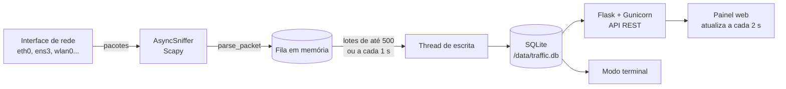

# Analisador de tráfego de rede

Aplicação em Python que captura pacotes de uma interface de rede, grava cada pacote em um banco de dados e exibe estatísticas em um painel web atualizado em tempo real. Também há um modo de terminal para quem prefere não usar o navegador.

Para cada pacote são registrados: IP de origem, IP de destino, protocolo e tamanho (além do horário). O painel mostra o total de pacotes, a distribuição por protocolo e os 5 IPs de origem e de destino com mais tráfego.

---

## Sumário

1. [Arquitetura](#1-arquitetura)
2. [Estrutura do projeto](#2-estrutura-do-projeto)
3. [Pré-requisitos](#3-pré-requisitos)
4. [Configuração](#4-configuração)
5. [Execução](#5-execução)
6. [Uso](#6-uso)
7. [Banco de dados](#7-banco-de-dados)
8. [Decisões técnicas e justificativas](#8-decisões-técnicas-e-justificativas)
9. [Testes](#9-testes)
10. [Hospedagem e publicação na internet](#10-hospedagem-e-publicação-na-internet)
11. [Limitações e próximos passos](#11-limitações-e-próximos-passos)

---

## 1. Arquitetura



Tudo roda em um único container Docker. O processo tem três peças:

- **Captura**: o `AsyncSniffer` do Scapy escuta a interface escolhida em uma thread própria. Para cada pacote, `parse_packet()` extrai os quatro campos e coloca uma tupla na fila. Nada de banco de dados acontece nesse caminho, para a captura não ficar esperando disco.
- **Gravação**: uma segunda thread esvazia a fila e grava em lote (`executemany` em uma transação). Ao parar a captura, ela termina de gravar o que estiver na fila antes de encerrar.
- **Apresentação**: o Flask expõe uma API JSON; as estatísticas são calculadas com SQL diretamente sobre os dados gravados. O painel é uma página HTML com JavaScript puro, sem build e sem frameworks.

## 2. Estrutura do projeto

```
traffic-analyzer/
├── app/
│   ├── capture.py        # captura com Scapy, extração de campos, fila e gravação em lote
│   ├── database.py       # schema SQLite e consultas de estatística
│   ├── main.py           # aplicação Flask (painel + API + autenticação)
│   ├── cli.py            # modo terminal (pergunta a interface no início)
│   └── templates/
│       └── index.html    # painel web
├── tests/                # testes de banco, parsing de pacotes e API
├── Dockerfile
├── docker-compose.yml
├── requirements.txt
├── requirements-dev.txt
└── .env.example
```

## 3. Pré-requisitos

- Docker Engine 20.10+ com o plugin Docker Compose v2 (`docker compose`).
- Host **Linux** (servidor, VM ou máquina local). Em Linux o container usa a rede do host e enxerga as interfaces reais.

> **Docker Desktop (Windows/macOS):** a aplicação roda, mas o Docker Desktop executa os containers dentro de uma VM. A rede de host, quando habilitada, mostra as interfaces dessa VM e não as do seu computador. Para capturar o tráfego real da sua máquina, use Linux nativo, WSL2 com Docker Engine instalado dentro dele, ou uma VM Linux em modo bridge.

## 4. Configuração

Copie o arquivo de exemplo e ajuste:

```bash
cp .env.example .env
```

| Variável | Padrão | Descrição |
|---|---|---|
| `APP_USER` | `admin` | Usuário do painel (HTTP Basic). |
| `APP_PASSWORD` | vazio | Senha do painel. **Vazio desativa a autenticação** (só aceitável em uso local). |
| `BIND_ADDRESS` | `0.0.0.0:8000` | Endereço e porta do servidor web. Em produção atrás de proxy, use `127.0.0.1:8000`. |
| `CAPTURE_INTERFACE` | vazio | Se definida, a captura começa automaticamente nessa interface ao subir o container. |
| `CAPTURE_FILTER` | vazio | Filtro BPF para a captura automática, ex.: `not port 8000`. |
| `BATCH_SIZE` | `500` | Máximo de pacotes por transação de gravação. |
| `FLUSH_INTERVAL` | `1.0` | Intervalo máximo (s) entre gravações. |
| `LOG_LEVEL` | `INFO` | Nível de log. |

O `docker compose` lê o `.env` automaticamente.

## 5. Execução

### 5.1 Com Docker Compose (recomendado)

```bash
docker compose up -d --build
docker compose logs -f          # acompanhar logs
```

Abra `http://localhost:8000` (ou `http://IP-DO-SERVIDOR:8000`). Para parar: `docker compose down`. Os dados ficam no volume `traffic-data` e sobrevivem a reinícios; `docker compose down -v` apaga também os dados.

### 5.2 Com `docker run`

```bash
docker build -t traffic-analyzer .
docker run -d --name traffic-analyzer \
  --network host --cap-add NET_RAW --cap-add NET_ADMIN \
  -e APP_PASSWORD=minha-senha \
  -v traffic-data:/data \
  traffic-analyzer
```

### 5.3 Modo terminal (solicita a interface no início)

```bash
docker compose run --rm traffic-analyzer python -m app.cli
```

```
Interfaces disponíveis:
  1. docker0
  2. eth0
  3. lo
Escolha a interface (número ou nome): 2
```

A tela é redesenhada a cada 2 segundos com as estatísticas. `Ctrl+C` encerra e mantém os dados gravados. Também aceita argumentos: `python -m app.cli -i eth0 -f "tcp port 443"`.

> Não rode o modo terminal e o painel capturando ao mesmo tempo sobre o mesmo banco por longos períodos; funciona (SQLite em modo WAL suporta isso), mas cada um cria a sua própria sessão.

### 5.4 Sem Docker (desenvolvimento)

```bash
python3 -m venv .venv && . .venv/bin/activate
pip install -r requirements-dev.txt
sudo apt install tcpdump            # usado pelo Scapy para compilar filtros BPF
export DB_PATH=./data/traffic.db
sudo -E .venv/bin/python -m app.main   # captura exige root ou CAP_NET_RAW
```

## 6. Uso

### 6.1 Painel web

1. Escolha a **interface de rede** na lista (ela é obtida do sistema).
2. Opcionalmente, informe um **filtro BPF** (mesma sintaxe do tcpdump), por exemplo `tcp`, `udp port 53`, `host 8.8.8.8` ou `not port 8000`.
3. Clique em **Iniciar captura**.

O painel mostra:

- **Fita de pacotes**: os últimos pacotes como barras, coloridas por protocolo e com altura proporcional ao tamanho. Permite perceber de relance rajadas de tráfego e a mistura de protocolos.
- **Resumo**: total de pacotes, volume em bytes, taxa média e quantidade de protocolos distintos.
- **Pacotes por protocolo** com contagem e percentual.
- **Top 5 IPs de origem e de destino**, ordenáveis por bytes ou por número de pacotes.
- **Pacotes recentes** com os campos capturados.

Cada início de captura cria uma **sessão**. O seletor *Sessão* permite consultar capturas anteriores.

> **Dica:** ao acessar o painel pela mesma interface que está sendo capturada, as próprias requisições do painel entram na captura. Use o filtro `not port 8000` (ou `not port 443` atrás de proxy HTTPS) para excluí-las.

### 6.2 API REST

Todas as rotas (exceto `/healthz`) exigem autenticação quando `APP_PASSWORD` está definida.

| Método | Rota | Descrição |
|---|---|---|
| GET | `/api/interfaces` | Lista as interfaces disponíveis. |
| GET | `/api/status` | Estado da captura (ativa, interface, contadores, descartes). |
| POST | `/api/capture/start` | Inicia. Corpo: `{"interface": "eth0", "filter": "tcp"}`. |
| POST | `/api/capture/stop` | Para a captura em andamento. |
| GET | `/api/stats?session_id=&order=bytes\|packets` | Estatísticas da sessão (padrão: a atual ou a mais recente). |
| GET | `/api/packets?session_id=&limit=50` | Últimos pacotes gravados (máx. 500). |
| GET | `/api/sessions` | Histórico de sessões com total de pacotes. |
| DELETE | `/api/sessions/<id>` | Apaga uma sessão e seus pacotes. |
| GET | `/healthz` | Verificação de saúde (sem autenticação). |

Exemplo:

```bash
curl -u admin:minha-senha -X POST localhost:8000/api/capture/start \
     -H 'Content-Type: application/json' -d '{"interface":"eth0","filter":"not port 8000"}'
curl -u admin:minha-senha 'localhost:8000/api/stats?order=packets'
```

Resposta resumida de `/api/stats`:

```json
{
  "session_id": 3,
  "total_packets": 2400,
  "total_bytes": 1245310,
  "protocols": [{"protocol": "TCP", "packets": 1437, "bytes": 980112}, "..."],
  "top_sources": [{"ip": "104.18.32.7", "packets": 342, "bytes": 190240}, "..."],
  "top_destinations": ["..."],
  "ordered_by": "bytes"
}
```

## 7. Banco de dados

### 7.1 Schema

```sql
CREATE TABLE capture_sessions (
    id          INTEGER PRIMARY KEY AUTOINCREMENT,
    interface   TEXT    NOT NULL,
    bpf_filter  TEXT,
    started_at  REAL    NOT NULL,   -- epoch UTC
    stopped_at  REAL                -- NULL enquanto ativa
);

CREATE TABLE packets (
    id          INTEGER PRIMARY KEY AUTOINCREMENT,
    session_id  INTEGER NOT NULL REFERENCES capture_sessions(id) ON DELETE CASCADE,
    captured_at REAL    NOT NULL,   -- timestamp do pacote (epoch)
    src_ip      TEXT,               -- IPv4 ou IPv6; NULL se o quadro não tem IP/ARP
    dst_ip      TEXT,
    protocol    TEXT    NOT NULL,   -- TCP, UDP, ICMP, ICMPv6, ARP, IP-<n>, OTHER
    length      INTEGER NOT NULL    -- bytes no fio
);

CREATE INDEX idx_packets_session_protocol ON packets(session_id, protocol);
CREATE INDEX idx_packets_session_src      ON packets(session_id, src_ip);
CREATE INDEX idx_packets_session_dst      ON packets(session_id, dst_ip);
```

### 7.2 Justificativas do schema

- **Tabela de sessões separada.** O enunciado pede que a interface seja escolhida no início; guardar *qual* interface e *qual* filtro geraram cada conjunto de pacotes torna os números interpretáveis depois. Sem isso, capturas de `eth0` e `lo` se misturariam nas mesmas estatísticas. A remoção em cascata (`ON DELETE CASCADE`) permite apagar uma captura inteira com um comando.
- **Um registro por pacote (dados brutos), não contadores agregados.** O requisito é armazenar os pacotes capturados. Guardar o dado bruto também permite responder perguntas novas depois (top 5 por pacotes ou por bytes, recortes por horário) sem recapturar. As estatísticas são calculadas com `GROUP BY` na hora da consulta.
- **IPs como `TEXT`.** Um mesmo campo comporta IPv4 e IPv6 no formato legível, sem conversões. A economia de espaço de armazenar IPv4 como inteiro não compensa a perda de suporte a IPv6 e a complexidade extra.
- **Protocolo como `TEXT` normalizado** (`TCP`, `UDP`...), e não como o número IANA. A consulta e o painel ficam diretos; protocolos sem nome conhecido viram `IP-<número>`, então nenhuma informação se perde.
- **Timestamps como `REAL` (epoch)**: precisão de microssegundos, ordenação e aritmética simples (a taxa média é `bytes / (último - primeiro)`).
- **Índices compostos iniciados por `session_id`.** Todas as consultas filtram por sessão e então agrupam por protocolo, origem ou destino. Com o índice `(session_id, src_ip)`, o SQLite resolve o filtro e o agrupamento percorrendo o índice já ordenado. Não há índice em `captured_at` porque nenhuma consulta frequente filtra por tempo, e cada índice a mais custa em toda inserção.
- **`src_ip`/`dst_ip` anuláveis**: quadros sem camada IP nem ARP (LLDP, STP etc.) ainda são contados no total e em `OTHER`, mas não poluem os rankings de IP (as consultas usam `IS NOT NULL`).

### 7.3 Consultas principais

```sql
-- Total
SELECT COUNT(*), SUM(length) FROM packets WHERE session_id = ?;
-- Por protocolo
SELECT protocol, COUNT(*), SUM(length) FROM packets WHERE session_id = ?
GROUP BY protocol ORDER BY COUNT(*) DESC;
-- Top 5 origens (por bytes; "por pacotes" troca a ordenação)
SELECT src_ip, COUNT(*) AS packets, SUM(length) AS bytes FROM packets
WHERE session_id = ? AND src_ip IS NOT NULL
GROUP BY src_ip ORDER BY bytes DESC LIMIT 5;
```

A coluna de ordenação vem de uma lista branca (`bytes`/`packets`) e nunca é interpolada a partir da entrada do usuário.

## 8. Decisões técnicas e justificativas

**Scapy para captura.** É a biblioteca Python mais madura para manipular pacotes: decodifica Ethernet, IPv4, IPv6, ARP e centenas de protocolos, aceita filtros BPF e oferece o `AsyncSniffer`, que captura em uma thread e pode ser parado de forma limpa. Alternativas consideradas:
- *pyshark*: depende do `tshark` (Wireshark) e de um processo externo, o que deixa a imagem maior e a captura mais lenta.
- *socket raw puro*: mais rápido, mas exigiria escrever à mão a decodificação de IPv4, IPv6 com cabeçalhos de extensão e ARP, com mais pontos de erro.

**Extração dos campos.**
- *Tamanho*: usa `wirelen` (tamanho real no fio) quando disponível, senão o tamanho capturado.
- *IPv6*: o campo "próximo cabeçalho" pode apontar para cabeçalhos de extensão (Hop-by-Hop, Routing, Fragment, Destination Options); o código os percorre até achar o protocolo de transporte real. Sem isso, pacotes MLD/ICMPv6 apareceriam como protocolo "0".
- *ARP* é registrado com os endereços IP de origem e destino da requisição, porque é tráfego comum em redes locais e o enunciado pede IPs.
- Um pacote malformado é descartado com log em nível debug, sem derrubar a captura.

**Fila em memória e gravação em lote.** Inserir pacote a pacote no SQLite faria um commit por pacote, o que limita a captura a algumas centenas de pacotes por segundo. Com lotes de até 500 pacotes ou a cada 1 s, o custo do commit é diluído. A fila tem limite (100 mil itens); se o disco não acompanhar, pacotes excedentes são **contados como descartados** e exibidos no painel, em vez de a memória crescer sem limite.

**SQLite (em vez de PostgreSQL/MySQL).**
- Não exige um segundo container nem rede entre containers, o que importa aqui porque o container de captura usa a rede do host.
- O modo WAL permite que o painel leia enquanto a captura grava.
- É um arquivo único num volume Docker, fácil de copiar e inspecionar (`sqlite3 traffic.db`).
- Para um único sensor, atende bem dezenas de milhões de linhas. Se o projeto evoluir para vários sensores gravando num banco central, a camada de acesso está isolada em `database.py` (SQL padrão), e a migração para PostgreSQL é localizada.

**Flask + Gunicorn com 1 worker e 8 threads.** O estado da captura (sniffer, fila, contadores) vive na memória do processo. Com vários workers, cada um teria seu próprio estado e "parar captura" poderia cair em outro processo. Um worker com threads atende o painel com folga, já que a carga é de poucas requisições leves a cada 2 segundos.

**Painel com HTML e JavaScript puro, atualizado por polling a cada 2 s.** Sem etapa de build, sem dependências de frontend. Polling é mais simples que WebSocket e suficiente para essa frequência.

**Rede do host + capabilities mínimas.** Com a rede padrão do Docker (bridge), o container só veria a interface virtual `eth0` dele mesmo. `network_mode: host` dá acesso às interfaces reais. Em vez de `--privileged`, que dá acesso total ao host, são concedidas apenas `NET_RAW` (sockets de captura) e `NET_ADMIN` (modo promíscuo).

**Autenticação HTTP Basic opcional.** Um painel que mostra o tráfego de uma máquina não deve ficar aberto. HTTP Basic é simples, suportado por qualquer navegador e por `curl`, e a comparação de senha usa `hmac.compare_digest` (tempo constante). Deve sempre ser usado com HTTPS quando exposto à internet (seção 10).

**Sessões abertas após queda.** Ao iniciar, a aplicação marca como encerradas as sessões que ficaram abertas por um desligamento abrupto, mantendo o histórico consistente.

## 9. Testes

```bash
docker compose build --build-arg INSTALL_DEV=true
docker compose run --rm traffic-analyzer python -m pytest -q
```

- `test_database.py`: contagens, agrupamento por protocolo, top 5 por bytes e por pacotes, isolamento entre sessões, proteção da ordenação contra injeção.
- `test_parse.py`: extração de campos para IPv4/TCP, UDP, ICMP, IPv6 com cabeçalho de extensão, ICMPv6, ARP e quadros desconhecidos (pacotes montados com o próprio Scapy, sem rede).
- `test_api.py`: autenticação e fluxo iniciar → estatísticas → parar, com uma captura simulada (não precisa de privilégios).

## 10. Hospedagem e publicação na internet

### 10.1 Onde hospedar

A aplicação precisa capturar pacotes de uma interface real, o que exige **acesso à rede do host e às capabilities `NET_RAW`/`NET_ADMIN`**. Isso descarta plataformas gerenciadas de containers (Render, Railway, Heroku, Google Cloud Run, AWS App Runner, Azure Container Apps, Fly.io e similares): elas não permitem rede de host nem sockets de captura, e mesmo que permitissem você só veria o tráfego do próprio container.

O caminho certo é uma **máquina virtual (VPS) Linux** onde você controla o Docker:

| Opção | Observações |
|---|---|
| AWS EC2 / Lightsail | Região São Paulo (`sa-east-1`), boa latência no Brasil. |
| Oracle Cloud (OCI) | Tem camada gratuita permanente com VMs pequenas; regiões em São Paulo e Vinhedo. |
| Google Cloud Compute Engine | Região São Paulo; VMs pequenas com camada gratuita em algumas regiões dos EUA. |
| Azure Virtual Machines | Região Brazil South. |
| DigitalOcean, Hetzner, Vultr, Linode | Simples e baratos; poucas ou nenhuma região no Brasil. |
| Magalu Cloud, Locaweb | Provedores nacionais, cobrança em reais. |
| Nuvem privada (OpenStack, Proxmox) | Funciona igual a uma VPS; exige um IP público ou encaminhamento de portas. |

Confira as condições atuais de camada gratuita e preços no site de cada provedor. Uma VM com 1 vCPU e 1 GB de RAM com Ubuntu 22.04 ou 24.04 é suficiente.

> **O que será capturado:** na nuvem, a aplicação vê o tráfego **da própria VM** (o que chega e sai dela), não o da sua casa ou empresa. Para monitorar uma rede local, rode o container num computador dentro dessa rede e publique o painel com um túnel (ver 10.5).

### 10.2 Passo a passo em uma VPS Ubuntu

**1. Criar a VM** no provedor com Ubuntu 24.04, liberar SSH (22) e, no grupo de segurança/firewall do provedor, as portas 80 e 443. **Não libere a porta 8000.**

**2. Instalar Docker:**

```bash
ssh ubuntu@IP-DA-VM
curl -fsSL https://get.docker.com | sudo sh
sudo usermod -aG docker $USER && newgrp docker
```

**3. Enviar o projeto e configurar:**

```bash
git clone https://github.com/ricardoflnet/traffic-analyzer.git   # ou scp/rsync da pasta
cd traffic-analyzer
cp .env.example .env
nano .env
```

No `.env`, para produção:

```
APP_PASSWORD=uma-senha-longa-e-aleatoria
BIND_ADDRESS=127.0.0.1:8000          # só o proxy local acessa o app
CAPTURE_INTERFACE=eth0               # nome visto em `ip -br link`; ex.: eth0, ens3, ens5
CAPTURE_FILTER=not port 22 and not port 443
```

O filtro sugerido evita registrar o tráfego da sua própria sessão SSH e do próprio painel.

**4. Subir:**

```bash
docker compose up -d --build
curl -s localhost:8000/healthz      # {"status":"ok"}
```

### 10.3 HTTPS com domínio (Caddy)

O Caddy emite e renova certificados Let's Encrypt automaticamente.

1. Aponte um registro DNS `A` (ex.: `trafego.seudominio.com`) para o IP da VM. Sem domínio, use um serviço como `sslip.io`: `IP-COM-TRACOS.sslip.io`, ex.: `203-0-113-10.sslip.io`.
2. Instale e configure:

```bash
sudo apt install -y caddy
sudo tee /etc/caddy/Caddyfile >/dev/null <<'EOF'
trafego.seudominio.com {
    reverse_proxy 127.0.0.1:8000
}
EOF
sudo systemctl reload caddy
```

Acesse `https://trafego.seudominio.com` e entre com `APP_USER`/`APP_PASSWORD`.

**Alternativa com Nginx + Certbot:**

```nginx
# /etc/nginx/sites-available/traffic
server {
    server_name trafego.seudominio.com;
    location / {
        proxy_pass http://127.0.0.1:8000;
        proxy_set_header Host $host;
        proxy_set_header X-Forwarded-For $proxy_add_x_forwarded_for;
        proxy_set_header X-Forwarded-Proto $scheme;
    }
}
```

```bash
sudo ln -s /etc/nginx/sites-available/traffic /etc/nginx/sites-enabled/
sudo nginx -t && sudo systemctl reload nginx
sudo certbot --nginx -d trafego.seudominio.com
```

### 10.4 Firewall da VM

```bash
sudo ufw allow OpenSSH
sudo ufw allow 80,443/tcp
sudo ufw enable
```

Como o container usa a rede do host (sem portas publicadas pelo Docker), as regras do `ufw` se aplicam normalmente; ainda assim, `BIND_ADDRESS=127.0.0.1:8000` garante que o app não fica acessível de fora mesmo se o firewall for desativado.

### 10.5 Publicar um painel que roda na rede local (sem VPS)

Para capturar o tráfego da sua rede e ainda acessar o painel pela internet, rode o container num computador Linux da rede e use um túnel, sem abrir portas no roteador:

- **Cloudflare Tunnel**: `cloudflared tunnel --url http://localhost:8000` (rápido para testes; para uso fixo, crie um túnel nomeado com domínio).
- **Tailscale**: acesso privado apenas a partir dos seus dispositivos, sem exposição pública.

### 10.6 Checklist de segurança

- `APP_PASSWORD` forte e **sempre** HTTPS na frente (HTTP Basic sem TLS trafega a senha legível).
- Porta 8000 nunca exposta diretamente.
- Atualizações: `git pull && docker compose up -d --build`.
- Backup do banco: `docker run --rm -v traffic-analyzer_traffic-data:/data -v $PWD:/backup alpine cp /data/traffic.db /backup/` (o nome do volume pode variar; confira com `docker volume ls`).
- Os dados capturados podem revelar com quem a máquina se comunica. Capture apenas redes que você administra ou tem autorização para monitorar.

## 11. Limitações e próximos passos

- **Volume de tráfego:** Scapy decodifica em Python e atende bem tráfego moderado (milhares de pacotes por segundo). Para links de alta vazão, as alternativas são aplicar filtro BPF para reduzir o volume, amostrar pacotes ou trocar a captura por `libpcap` via `pcapy`/`dpkt`.
- **Retenção:** os pacotes ficam armazenados indefinidamente. Uma melhoria natural é uma política de retenção (apagar sessões antigas) ou agregação por minuto para históricos longos.
- **Uma captura por vez:** escolha deliberada para manter o estado simples; múltiplas interfaces simultâneas exigiriam um gerenciador por interface.
- **Possíveis evoluções:** WebSocket em vez de polling, gráficos de série temporal (pacotes/s ao longo do tempo), resolução reversa de DNS dos top IPs, exportação em CSV/PCAP e PostgreSQL para vários sensores.
